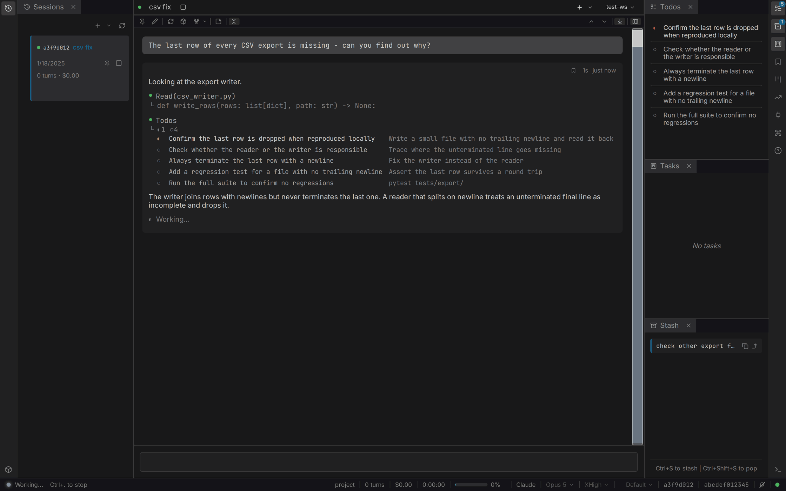

# Claudebox

[](LICENSE)
[](pyproject.toml)
[](#)

Containerized isolation, customizable agent profiles, and a visual web UI — for AI coding agents.

Claudebox runs AI coding agents in disposable containers — one per session, full agent capabilities, controlled host exposure. It runs Claude Code via the Claude Agent SDK by default, or any LangChain provider (Ollama, OpenAI, Gemini, and more) via LangGraph. Profiles layer in system prompts, hooks, commands, skills, agents, and custom tools — install and customize what each project needs. The web interface renders the full conversation — markdown, code, diffs, and diagrams — while dockable panels track tasks, queue follow-up messages, switch between sessions, and fork at any point in history: a multi-panel workspace the terminal can't replicate.



## Prerequisites

- **Podman** or Docker
- **Git**
- **Bash**
- **Python** 3.13+ (managed via [uv](https://docs.astral.sh/uv/), installed automatically if not present)
- **Node.js** 24+ (managed via [nvm](https://github.com/nvm-sh/nvm), installed automatically if not present)

## Installation

```bash
# Podman (default)
curl -LsSf https://raw.githubusercontent.com/jakubro/claudebox/main/bin/install.sh | bash

# Docker
CLAUDEBOX_BACKEND=docker curl -LsSf https://raw.githubusercontent.com/jakubro/claudebox/main/bin/install.sh | bash

# First run — authenticate via TUI (one-time)
claudebox run

# Then open https://localhost:41820
```

This clones the library, builds the frontend and container image, installs the `claudebox` CLI and `claudeboxd` daemon, registers the daemon as a systemd user service, and installs a daily maintenance timer that rebuilds the container image.

> First install builds the container image from scratch — expect 5-15 minutes on first run depending on network and CPU.

## Quick Start

The first launch (`claudebox run`) opens the Claude Code TUI where you complete authentication. Credentials persist across sessions within the same workspace (or globally when no `.workspace` marker is set). After login, you can use either TUI or web mode.

The web UI is served by `claudeboxd`, a daemon installed during setup, at [https://localhost:41820](https://localhost:41820). Caddy fronts the daemon with a self-signed TLS certificate; your browser will show a one-time certificate warning that's safe to accept. The daemon manages container lifecycles and proxies requests to the per-session container API.

> On systems without systemd (e.g. macOS), the daemon service is not installed automatically. Start it manually with `claudeboxd`.

## Documentation

Full documentation is published at **[jakubro.github.io/claudebox](https://jakubro.github.io/claudebox/)**.

- [Start here](https://jakubro.github.io/claudebox/start/) — install, first session, where the files landed
- [Features](https://jakubro.github.io/claudebox/features/chat/) — chat, threads, rendering, panels, boards, nested containers, many sessions
- [Guides](https://jakubro.github.io/claudebox/guide/profiles/) — profiles, workspaces, configuration, runtimes, troubleshooting
- [CLI reference](https://jakubro.github.io/claudebox/reference/cli/) — every verb and flag
- [Configuration reference](https://jakubro.github.io/claudebox/reference/configuration/) — every settings key
- [Keyboard shortcuts](https://jakubro.github.io/claudebox/reference/shortcuts/)
- [Specification](https://jakubro.github.io/claudebox/spec/) — the full user-facing behavior contract

Contributor documents live alongside the source: [ARCHITECTURE.md](docs/ARCHITECTURE.md), [GUIDELINES.md](docs/GUIDELINES.md), [TEST-UI.md](docs/TEST-UI.md).

## Security

Claudebox's trust boundary is the container. Agents run with `--permission-mode bypassPermissions` and can execute anything inside their container. The container, in turn, has read/write access to the workspace directory (mounted at the same path inside and outside).

- **Inside the container**: agent has full filesystem access to the workspace, full network access, and can install packages.
- **Outside the workspace**: protected by the container boundary — agent cannot read or write host files outside the mounted workspace.
- **Daemon network surface**: Caddy listens on all interfaces at the configured port (default 41820) with a self-signed TLS certificate. There is no built-in auth on the HTTP surface, so anyone with network access to the host can reach the daemon. Bind to localhost, firewall the port, or front with an authenticated reverse proxy if hosting on a network you don't control.
- **Nested containers**: `[containers] nested = true` lets the agent run its own containers — no `--privileged` flag, tmpfs-backed, invisible to the host and to sibling sessions, gone when the session ends. Off unless set.
- **Credentials**: Claude Code's auth token lives at `.claudebox/fs/root/.claude.json` (per-workspace) or `~/.claudebox/fs/root/.claude.json` (global). Treat these as you would any other API token.

Claudebox itself is telemetry-free.

## Contributing

```bash
git clone https://github.com/jakubro/claudebox.git
cd claudebox/lib
just install          # python + frontend + e2e deps
just check            # full pre-commit (lint + test)
just --list           # all recipes, grouped
```

Coding conventions, testing patterns, and the development workflow are documented in [`docs/GUIDELINES.md`](docs/GUIDELINES.md). All development commands run from `lib/` via the [justfile](justfile).

## Uninstall

```bash
# Stop and disable systemd units
systemctl --user disable --now claudebox-daemon.service claudebox-maintenance.timer claudebox-watchdog.timer
rm -f ~/.config/systemd/user/claudebox-*
systemctl --user daemon-reload

# Remove CLI symlinks
rm -f ~/.local/bin/claudebox ~/.local/bin/claudeboxd

# Remove library, state, and credentials (irreversible)
rm -rf ~/.claudebox

# Remove containers and images
podman container prune -f --filter label=app=claudebox
podman image prune -f --filter label=app=claudebox
```

## Limitations

- **Linux-first**: Full automation (systemd daemon + maintenance timer) requires systemd. macOS works without auto-start; daemon must be launched manually.
- **Single-host**: `claudeboxd` is intended for the local machine. It listens on all interfaces by default but has no built-in auth, so exposing it on an untrusted network requires fronting it with an authenticated reverse proxy.
- **Single-user**: One user per host; no multi-tenant isolation beyond podman's rootless boundary.
- **Container runtime**: Podman or Docker. Other OCI runtimes untested.

## Built With

Claudebox is a thin layer over other people's work.

- **Agent runtimes** — [Claude Code](https://github.com/anthropics/claude-code), [Claude Agent SDK](https://docs.anthropic.com/claude/docs/agent-sdk), [LangGraph](https://langchain-ai.github.io/langgraph/), [LangChain](https://www.langchain.com/), [Model Context Protocol](https://modelcontextprotocol.io/), [Ollama](https://ollama.com/)
- **Interface** — [React](https://react.dev/), [Vite](https://vite.dev/), [Dockview](https://dockview.dev/), [dnd kit](https://dndkit.com/), [Floating UI](https://floating-ui.com/), [TanStack Virtual](https://tanstack.com/virtual), [Lucide](https://lucide.dev/)
- **Typefaces** — [Inter](https://rsms.me/inter/), [JetBrains Mono](https://www.jetbrains.com/lp/mono/)
- **Rendering** — [react-markdown](https://github.com/remarkjs/react-markdown), [remark/rehype](https://unifiedjs.com/), [Mermaid](https://mermaid.js.org/), [KaTeX](https://katex.org/), [highlight.js](https://highlightjs.org/), [react-syntax-highlighter](https://github.com/react-syntax-highlighter/react-syntax-highlighter), [DOMPurify](https://github.com/cure53/DOMPurify), [jsdiff](https://github.com/kpdecker/jsdiff)
- **Backend** — [FastAPI](https://fastapi.tiangolo.com/), [Starlette](https://www.starlette.io/), [Uvicorn](https://www.uvicorn.org/), [HTTPX](https://www.python-httpx.org/), [Pydantic](https://docs.pydantic.dev/), [structlog](https://www.structlog.org/), [Rich](https://github.com/Textualize/rich), [ruamel.yaml](https://sourceforge.net/projects/ruamel-yaml/)
- **Container and toolchain** — [Podman](https://podman.io/), [Docker](https://www.docker.com/), [Ubuntu](https://ubuntu.com/), [Bubblewrap](https://github.com/containers/bubblewrap), [mise](https://mise.jdx.dev/), [uv](https://docs.astral.sh/uv/), [nvm](https://github.com/nvm-sh/nvm), [Node.js](https://nodejs.org/), [just](https://just.systems/), [Caddy](https://caddyserver.com/)
- **Testing and quality** — [Playwright](https://playwright.dev/), [Vitest](https://vitest.dev/), [pytest](https://docs.pytest.org/), [Biome](https://biomejs.dev/), [Ruff](https://docs.astral.sh/ruff/), [ty](https://github.com/astral-sh/ty), [Knip](https://knip.dev/), [jscpd](https://github.com/kucherenko/jscpd)

## License

Copyright (C) 2025-2026 Jakub Roman. Distributed under the [GNU GPL v3](LICENSE).

Third-party licenses and the notices that must accompany a redistributed build are recorded in [NOTICE.md](NOTICE.md).
