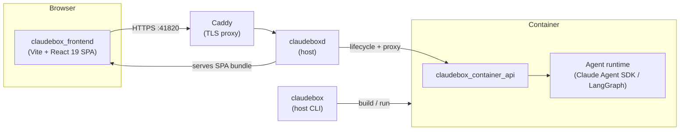

# Claudebox

[](LICENSE)
[](pyproject.toml)
[](#)

Containerized isolation, customizable agent profiles, and a visual web UI — for AI coding agents.

Claudebox runs AI coding agents in disposable containers — one per session, full agent capabilities, controlled host exposure. Claude Code via the Claude Agent SDK by default, or any LangChain provider (Ollama, OpenAI, Gemini, and more) via LangGraph. Profiles layer in system prompts, hooks, commands, skills, agents, and custom tools — install and customize what each project needs. The web interface renders the full conversation — markdown, code, diffs, and diagrams — while dockable panels let you manage sessions, track tasks, browse and edit files, queue follow-up messages, switch between sessions, and fork at any point in history: a multi-panel workspace the terminal can't replicate.

## Prerequisites

- **Podman** or Docker
- **Git**
- **Bash**
- **Python** 3.11+ (managed via [uv](https://docs.astral.sh/uv/), installed automatically if not present)
- **Node.js** 24+ (managed via [nvm](https://github.com/nvm-sh/nvm), installed automatically if not present)

## Installation

```bash
# Podman (default)
curl -LsSf https://raw.githubusercontent.com/jakubro/claudebox/main/bin/install.sh | bash

# Docker
CLAUDEBOX_BACKEND=docker curl -LsSf https://raw.githubusercontent.com/jakubro/claudebox/main/bin/install.sh | bash

# Then open https://localhost:41820
```

This clones the library, builds the frontend and container image, installs the `claudebox` CLI and `claudeboxd` daemon, registers the daemon as a systemd user service, and installs a daily maintenance timer that rebuilds the container image.

> First install builds a three-layer container image (base, profile, agent) — expect 5-15 minutes on first run depending on network and CPU.

## Quick Start

```bash
# First run — authenticate via TUI (one-time)
claudebox run
```

The first launch opens the Claude Code TUI where you complete authentication. Credentials persist across sessions within the same workspace (or globally when no `.workspace` marker is set). After login, you can use either TUI or web mode.

The web UI is served by `claudeboxd`, a daemon installed during setup, at [https://localhost:41820](https://localhost:41820). Caddy fronts the daemon with a self-signed TLS certificate; your browser will show a one-time certificate warning that's safe to accept. The daemon manages container lifecycles and proxies requests to the per-session container API.

> On systems without systemd (e.g. macOS), the daemon service is not installed automatically. Start it manually with `claudeboxd`.

## Configuration

Claudebox looks for `.claudebox/settings.toml` files walking up from your current directory and deep-merges them (nearest wins). This lets you keep shared defaults at `~/.claudebox/settings.toml` and project-specific overrides inside each workspace.

```toml
# Stop searching for settings.toml in parent directories
root = true

# Path to profile directory containing Claudebox customizations
profile = "~/.claudebox/profile"

# AI agent to launch inside container (default: "claude")
agent = "claude"

# Container runtime (default: "podman")
backend = "podman"

# Volume mounts: host path → container path
[mounts]
"/data/models" = "/models"

# Port forwarding: host port → container port (use 0 for random host port)
[ports]
8080 = 80

# Container network mode
[network]
mode = "slirp4netns:allow_host_loopback=true"

# Environment variables passed to the container
[env]
CLAUDE_CODE_DISABLE_NONESSENTIAL_TRAFFIC = 1
```

Your workspace directory is automatically mounted at the same path inside the container — no configuration needed. See [`etc/settings.sample.toml`](etc/settings.sample.toml) for a commented template of every key.

## Profiles

Profiles customize the container environment, system prompts, and lifecycle hooks. A profile directory can contain:

```
profile/
├── hooks/
│   ├── container-start.sh # Sourced on container init
│   ├── container-end.sh   # Sourced on container exit
│   ├── agent-start.sh     # Executed on agent session start
│   ├── agent-stop.sh      # Executed on agent session end
│   └── image-build.sh     # Custom profile image layer
└── prompt.md              # System prompt entry point
```

**Prompt compiler.** The prompt system supports `{{ }}` interpolation for modular prompt composition:

| Syntax | Resolution |
|--------|------------|
| `{{ relative/path }}` | Include file relative to the prompt file, recursively interpolated |
| `{{ @path }}` | Include file relative to workspace root |
| `{{ /absolute/path }}` | Include absolute path as-is |
| `{{ !function }}` | Call a `fn_function()` bash function (built-ins: `!path` for cwd, `!tree` for filtered directory listing) |

Indentation is preserved: when `{{ content }}` appears indented, all included lines inherit the same indent prefix.

**Claude Code SDK hooks.** In addition to shell lifecycle hooks, profiles can include Python hooks processed by the `@hook` and `@statusline` decorators. These integrate with the Claude Code hook system (SessionStart, PreToolUse, PostToolUse, etc.) for programmatic control over agent behavior.

Point your config at a profile with `profile = "/path/to/profile"`. See [`etc/profile.sample/`](etc/profile.sample/) for a working example with modular prompts, lifecycle hooks, a multi-agent review command, and an MCP skill.

## Workspaces

Without a `.workspace` marker, claudebox runs unscoped and stores all state on the host at `~/.claudebox/`.

For per-project isolation, create a `.workspace` marker file in your project root:

```bash
touch .workspace
```

With a marker in place, claudebox stores everything under `{workspace}/.claudebox/` instead — sessions, Claude credentials, and UI state stay scoped to that project. This is the recommended setup when working across multiple projects.

**Storage layout** (relative to whichever root is active):

| Path | Contents |
|------|----------|
| `.claudebox/settings.toml` | Settings — overrides the global `~/.claudebox/settings.toml` |
| `.claudebox/sessions/YYYYMMDD-HHMMSS--{session_id}/` | Per-session data, events, logs |
| `.claudebox/fs/root/.claude.json` | Claude Code auth/config file (mounted into the container) |
| `.claudebox/fs/root/.claude/` | Claude Code config directory (settings, commands, skills) |

**Daemon registration.** Workspaces register with the daemon via `claudebox workspaces register`. Only registered workspaces appear in the web UI workspace switcher.

**Multi-workspace mode.** The daemon tracks all registered workspaces and exposes them through the web UI. When multiple workspaces are registered, a workspace switcher dropdown appears in the Session Header Strip. Sessions, containers, and UI state are fully isolated per workspace. URL hash forms for deep linking:

| Hash form | Meaning |
|-----------|---------|
| `#/workspaces/{id}` | Welcome state, no active session |
| `#/workspaces/{id}/sessions/{sid}` | Active session, view scrolled to the latest message |
| `#/workspaces/{id}/sessions/{sid}/turns/u-{tid}` | Paused at a user message |
| `#/workspaces/{id}/sessions/{sid}/turns/a-{tid}` | Paused at an assistant message |
| `#/workspaces/{id}/boards/{bid}` | Active ticket board |

## Web UI

The web UI provides a full-featured chat interface with a dockable panel system. Each browser tab hosts exactly one session — multiple sessions = multiple browser tabs. Each session runs in its own container; creating, resuming, or forking a session spins up a dedicated container that is removed when you close the browser tab.

### Layout

```
┌─────────────┬─────────────────────────────────┬───────────────────┐
│ Session Header Strip:  status · name · Stop · + · Workspace ▾     │
├─────────────┼─────────────────────────────────┼───────────────────┤
│ Sessions    │            Chat                 │  Todos            │
│             │                                 │  Stash            │
│             │                                 │  Tasks            │
│             │                                 │  Bookmarks        │
│             │                                 │  Boards           │
│             │                                 │  Usage            │
│             │                                 │  MCP              │
│             │                                 │  Skills           │
│             │                                 │  Help             │
├─────────────┼─────────────────────────────────┼───────────────────┤
│ Containers  │                                 │  Logs             │
├─────────────┴─────────────────────────────────┴───────────────────┤
│ Footer: workspace · cost · context · model · effort · permission  │
│         · session id · notifications · service status             │
└───────────────────────────────────────────────────────────────────┘
```

Panels toggle from icon strips on the left (Sessions, Containers) and right (Todos, Stash, Tasks, Bookmarks, Boards, Usage, MCP, Skills, Help, Logs) edges. Double-click a tab to maximize; middle-click closes a side panel tab (except Chat — Chat is always visible). All panel sizes and visibility persist across sessions. Workspace accent colors tint the tab bar gradient for quick visual identification.

### Chat

- Real-time streaming responses with markdown rendering, syntax-highlighted code blocks, and mermaid diagrams
- Collapsible tool blocks with formatted summaries (file diffs, grep results, search hits)
- Inline interactive forms — answer questions and review plans without leaving the chat
- Drag-drop or paste file/image attachments
- Input history (Up/Down), draft persistence, and auto-resize textarea
- XML block folding in the input area (Ctrl+' to collapse, Ctrl+\ to expand)
- Rewind to any user message — fork here (replaces current session) or fork in new browser tab
- Inline quote-and-reply — drag-select any message text to quote it, reply to several fragments in a side comments bar, and send them together as one turn (desktop)
- Turn-level copy buttons, collapsible turns, duration and timestamp badges
- Slash command autocomplete — type `/` at the start of input for a substring-matched dropdown of available commands

### Minimap

A proportional conversation overview rendered alongside the chat:

- Each turn shown as a colored segment scaled to its content height
- Click or drag to scroll the conversation
- Visible-area indicator tracks current scroll position
- Yellow markers for bookmarked turns
- Toggleable via control bar button — state persists

### Message Queue

Queue follow-up messages while Claude is still responding:

- **Alt+Enter** queues a message instead of sending it immediately
- Queued messages appear as dimmed bubbles below the current response
- Queue drains FIFO — each response completion auto-sends the next message
- Hover a queued bubble for send-now, edit, or cancel actions
- Interrupts and errors pause the queue; re-queue or cancel paused messages
- Queue persists per session across page reloads

### Sessions

- Create, resume, rename, and pin sessions
- Session tree with fork hierarchy — rewinds nest under their parent
- Session prompt editor — inject per-session context that survives compaction (re-injected after each compaction)
- Cost tracking per session and aggregated in the Usage panel (24h / 7d / 30d / all-time)

### Todos

- Real-time todo list showing current tasks from the agent
- Status icons: pending (○), in progress (◐), completed (●)
- Subagent segmentation — todos grouped by the task that created them
- Badge count on the icon strip shows incomplete items

### Tasks

- Monitor background tasks spawned by the agent
- Filter between active (running) and all tasks
- Live duration tracking with staleness indication
- Click a task to jump to it in the chat

### Stash

Temporary text clipboard for storing and retrieving prompts. Ctrl+S to stash current input, Ctrl+Shift+S to pop.

### Bookmarks

- Bookmark any user message turn — toggle via button on hover
- Bookmarks panel (Alt+5) with "This session" and "All sessions" tabs
- Click a bookmark to scroll to the turn; remove on hover
- Yellow minimap indicator for bookmarked turns
- Cross-tab sync — bookmarks update across browser tabs automatically

### Boards

Kanban-style ticket boards:

- Multiple swimlanes per board with configurable states (e.g. backlog → in-progress → done)
- Ticket cards with title, ID, assignee, and metadata; click to open detail overlay
- Drag-and-drop tickets between states and swimlanes
- Multi-select for bulk move and archive
- Density modes (comfortable / terse) for fitting more cards on screen
- Real-time updates across browser tabs viewing the same board

### MCP

- Server connection status with colored indicators (connected/disconnected/failed)
- Reconnect button for failed servers, disable/enable toggle for all servers
- Loading spinner during actions, error messages with auto-clear

### Footer

Workspace, API cost, context usage bar with color gradient, model picker, effort level picker, permission mode picker, session ID, notification toggle, and Claude service status indicator (sourced from status.claude.com).

The model, effort level, and permission mode indicators are interactive dropdowns — click to switch mid-conversation.

### Keyboard Shortcuts

| Shortcut | Action |
|----------|--------|
| Enter | Send message |
| Alt+Enter | Queue message |
| Shift+Enter | New line |
| Tab | Indent |
| Shift+Tab | Dedent |
| Ctrl+. | Interrupt response |
| Up / Down | Input history |
| Ctrl+S | Stash input |
| Ctrl+Shift+S | Pop from stash |
| Ctrl+, | Wrap selection in `<this></this>` |
| Ctrl+' | Collapse nearest XML block |
| Ctrl+Shift+' | Collapse all XML blocks |
| Ctrl+\ | Expand nearest collapsed block |
| Ctrl+Shift+\ | Expand all collapsed blocks |
| Alt+Up / Alt+Down | Jump to previous/next user message |
| Alt+Home / Alt+End | Jump to first/last message |
| Alt+C | Focus Chat |
| Alt+0 | Toggle Logs |
| Alt+1 | Toggle Sessions |
| Alt+2 | Toggle Todos |
| Alt+3 | Toggle Stash |
| Alt+4 | Toggle Tasks |
| Alt+5 | Toggle Bookmarks |
| Alt+6 | Toggle Boards |
| Alt+7 | Toggle Usage |
| Alt+8 | Toggle MCP |
| Alt+9 | Toggle Skills |
| Alt+? (or Alt+/) | Help overlay |
| Alt+N | New session |
| Alt+Shift+N | New session in new tab |

### Notifications

- Desktop notifications and sound chime when a response completes while the tab is unfocused
- Favicon animation while Claude is working
- Tab title indicator (`*`) for unread responses

## Multi-runtime support

By default Claudebox runs Claude via the Claude Agent SDK. Set `agent = "langgraph"` to run on **LangGraph** instead, which talks to any LangChain-supported provider — Ollama, Anthropic, OpenAI, Google Gemini, Groq, Mistral, AWS Bedrock, and more. All provider packages ship preinstalled, so switching is config-only: set the model and credentials, then relaunch.

### Configuration

Add a `[langgraph]` block to `settings.toml` (global `~/.claudebox/settings.toml` or per-workspace — they deep-merge):

```toml
agent = "langgraph"

[langgraph]
model = "anthropic:claude-sonnet-4-5"   # "provider:model-id" form

[langgraph.ollama]
base_url = "http://host.containers.internal:11434"   # Ollama on the host
```

The model id follows LangChain's `init_chat_model` convention. Common providers:

| Provider | Env var | `model =` |
|---|---|---|
| Anthropic | `ANTHROPIC_API_KEY` | `"anthropic:claude-sonnet-4-5"` |
| OpenAI | `OPENAI_API_KEY` | `"openai:gpt-4o"` |
| Google Gemini | `GOOGLE_API_KEY` | `"google_genai:gemini-2.5-pro"` |
| Groq | `GROQ_API_KEY` | `"groq:llama-3.3-70b-versatile"` |
| Mistral | `MISTRAL_API_KEY` | `"mistralai:mistral-large-latest"` |
| Ollama | none | `"ollama:llama3.2:3b"` |
| Local OpenAI server (vLLM, LM Studio, llama.cpp) | none | `"openai:<model>"` + `[langgraph.openai] base_url` |

LangGraph workspaces also support MCP servers via `[langgraph.mcp.<name>]` blocks and a configurable `web_search` backend — see [`etc/settings.sample.toml`](etc/settings.sample.toml) for every knob.

### What's different under LangGraph

LangGraph binds the same core tools (filesystem, search, shell, web, MCP), but some Claude-only UI surfaces are hidden because the runtime doesn't support them: the effort picker, permission-mode picker, mid-session model picker, skills autocomplete, manual `/compact` button, and MCP control panel.

> Model calls, `web_fetch`/`web_search`, and `[langgraph.mcp.*]` servers all make outbound requests from the container. The container's network policy is the real boundary — review your configured providers before adopting in privacy-sensitive workspaces.

## Advanced

### CLI Reference

#### `claudebox` — verb-mode CLI

```
claudebox [-v] <command> [options] [-- agent-args]
```

| Command | Description |
|---------|-------------|
| `run` | Launch agent session in container |
| `build` | Build container image |
| `update` | Refresh Claudebox itself (re-runs install.sh; concurrent runs blocked by flock) |
| `shell` | Open bash shell in fresh container |
| `prune` | Remove stopped containers, dangling images, stale dirs |
| `logs` | Stream logs — `daemon` (default) tails the daemon log; `all` multiplexes daemon + every container with source prefixes |
| `status` | Show daemon + containers + workspace state in three rows (degraded mode when daemon is down) |
| `doctor` | Diagnose environment readiness — runs ordered checks and prints ✓/✗/○ per row |
| `version` | Print version, branch, commit, install path, python and podman versions |
| `daemon` | Manage host daemon — `start` / `stop` / `restart` / `status` (systemd --user wrappers) |
| `containers` | Manage containers — `list` / `stop` / `kill` across all workspaces (prefix resolution; `all` for fan-out) |
| `workspaces` | Manage registered workspaces — `list` / `register [path]` / `deregister <id>` |

Global flag: `-v` / `--verbose` is accepted before or after the verb (e.g. `claudebox -v build` and `claudebox build -v` are equivalent). `claudebox logs` accepts `--tail <N>` and `--no-follow` for backfill control. Run `claudebox <command> --help` for command-specific options.

**Examples:**

```bash
claudebox run                     # interactive agent session
claudebox run -- --resume         # resume the most recent agent conversation
claudebox run -- -p "prompt"      # non-interactive print mode
claudebox build                   # cached build (reuses all layers)
claudebox build --layer all       # full rebuild from base
claudebox build --layer agent     # rebuild agent layer only
claudebox shell                   # bash shell in fresh container
claudebox prune                   # summary count of removed resources
claudebox -v prune                # list each removed item
```

#### `claudeboxd` — Web UI daemon

```
claudeboxd [flags]
```

| Flag | Short | Description |
|------|-------|-------------|
| `--port` | `-p` | Daemon port (default: 41820) |
| `--dev` | `-d` | Development mode — uvicorn with hot reload for the API, Vite dev server for the frontend |

The container image is built in three layers, each rebuilt at different frequencies:

| Layer | Content | Rebuild frequency |
|-------|---------|-------------------|
| **Base** | System packages, mise, Python 3.13, Node 24, uv, Rust, just, gh | Rare (Containerfile changes) |
| **Profile** | Custom tools installed by the profile's `image-build.sh` hook | On profile change |
| **Agent** | Claude Code CLI (via mise) + Python dependencies (`uv sync`) | On `build --layer agent` |

`build` rebuilds all layers with caching. `build --layer agent` forces only the agent layer to rebuild (fast update for new Claude Code versions). `build --layer all` discards all caches.

### Shell completion (bash)

Turn on Tab-completion for the `claudebox` command by adding this line to your `~/.bashrc`:

```bash
[ -f ~/.claudebox/completion.bash ] && source ~/.claudebox/completion.bash
```

Reload your shell, and pressing Tab fills in commands and their arguments as you type — `claudebox <Tab>` lists the commands, `claudebox containers stop <Tab>` offers a running container, and `claudebox workspaces deregister <Tab>` offers a registered workspace.

### Maintenance

Claudebox ships with a systemd timer that rebuilds the agent layer of the container image daily to keep Claude Code and dependencies up to date. The timer is installed automatically during setup.

On macOS or systems without systemd, run maintenance manually:

```bash
claudebox update
```

This pulls the latest library, rebuilds the container image, and prunes old containers. (The underlying script lives at `~/.claudebox/lib/bin/install.sh` and can be invoked directly as a fallback.)

### Update

To update Claudebox itself (library + container image):

```bash
claudebox update
```

Same code path as fresh install — it detects an existing installation and reinstalls in place (library, frontend build, systemd units, container image). Concurrent invocations are blocked by an `flock` inside the install script; the second invocation exits non-zero immediately. The underlying script (`~/.claudebox/lib/bin/install.sh`) can still be invoked directly when needed.

### Logs

Daemon logs live under `~/.claudebox/logs/`. Per-session logs live inside each session directory (`.claudebox/sessions/.../`). When the daemon runs under systemd:

```bash
journalctl --user -u claudebox-daemon.service -f
```

For verbose CLI output, pass `--verbose`/`-v`. For a dev-mode daemon (hot-reload + Vite HMR), run `claudeboxd --dev`.

### Architecture

Claudebox is organized into five packages:

| Package | Role |
|---------|------|
| `claudebox` | Core framework — workspace discovery, config loading, hook system, container abstraction. Shared by all other packages. |
| `claudebox_cli` | Host-side CLI entry point. Parses arguments, builds container images, launches TUI containers. Registers workspaces via `workspaces register`. |
| `claudebox_daemon` | Host-side daemon (FastAPI). Orchestrates multiple workspaces and containers, proxies requests to container APIs, manages session lifecycle (create, resume, fork). Serves the frontend in production over HTTPS via a Caddy reverse proxy. |
| `claudebox_container_api` | In-container API server (FastAPI). Bridges the agent runtime (Claude Agent SDK or LangGraph) and the frontend via HTTP and SSE. One instance per container. |
| `claudebox_frontend` | Vite-built React 19 SPA. Communicates with the daemon and container APIs. Dockview-based panel layout. |



## Troubleshooting

| Symptom                                  | Remediation                                                                                                                                                   |
|------------------------------------------|---------------------------------------------------------------------------------------------------------------------------------------------------------------|
| Certificate warning on first visit       | Self-signed cert from Caddy — safe to accept once per browser                                                                                                 |
| First run very slow (~10 min)            | First install builds the container image; subsequent runs reuse cached layers                                                                                 |
| `claudeboxd` not running (no UI)         | `systemctl --user status claudebox-daemon.service`; on macOS run `claudeboxd` manually                                                                        |
| Port 41820 already in use                | `claudeboxd --port <other>` or kill the conflicting process                                                                                                   |
| Podman socket / `XDG_RUNTIME_DIR` errors | Ensure rootless podman is configured: `podman system migrate`, verify `XDG_RUNTIME_DIR` is set                                                                |
| Container fails to start                 | `claudebox --verbose` to see the full `podman run` command; check logs                                                                                        |
| Stale containers / disk pressure         | `claudebox prune` (or `claudebox -v prune` for per-item output)                                                                                               |
| Need daemon/container logs               | `journalctl --user -u claudebox-daemon.service -f` (systemd) or `~/.claudebox/logs/`                                                                          |

## Security

Claudebox's trust boundary is the container. Agents run with `--permission-mode bypassPermissions` and can execute anything inside their container. The container, in turn, has read/write access to the workspace directory (mounted at the same path inside and outside).

- **Inside the container**: agent has full filesystem access to the workspace, full network access, and can install packages.
- **Outside the workspace**: protected by the container boundary — agent cannot read or write host files outside the mounted workspace.
- **Daemon network surface**: Caddy listens on all interfaces at the configured port (default 41820) with a self-signed TLS certificate. There is no built-in auth on the HTTP surface, so anyone with network access to the host can reach the daemon. Bind to localhost, firewall the port, or front with an authenticated reverse proxy if hosting on a network you don't control.
- **Credentials**: Claude Code's auth token lives at `.claudebox/fs/root/.claude.json` (per-workspace) or `~/.claudebox/fs/root/.claude.json` (global). Treat these as you would any other API token.

Claudebox itself is telemetry-free.

## Contributing

```bash
git clone https://github.com/jakubro/claudebox.git
cd claudebox/lib
just install          # python + frontend + e2e deps
just check            # full pre-commit (lint + test)
just --list           # all recipes, grouped
```

Coding conventions, testing patterns, and the development workflow are documented in [`docs/GUIDELINES.md`](docs/GUIDELINES.md). All development commands run from `lib/` via the [justfile](justfile).

## Uninstall

```bash
# Stop and disable systemd units
systemctl --user disable --now claudebox-daemon.service claudebox-maintenance.timer
rm -f ~/.config/systemd/user/claudebox-*
systemctl --user daemon-reload

# Remove CLI symlinks
rm -f ~/.local/bin/claudebox ~/.local/bin/claudeboxd

# Remove library, state, and credentials (irreversible)
rm -rf ~/.claudebox

# Remove containers and images
podman container prune -f --filter label=app=claudebox
podman image prune -f --filter label=app=claudebox
```

## Limitations

- **Linux-first**: Full automation (systemd daemon + maintenance timer) requires systemd. macOS works without auto-start; daemon must be launched manually.
- **Single-host**: `claudeboxd` is intended for the local machine. It listens on all interfaces by default but has no built-in auth, so exposing it on an untrusted network requires fronting it with an authenticated reverse proxy.
- **Single-user**: One user per host; no multi-tenant isolation beyond podman's rootless boundary.
- **Container runtime**: Podman or Docker. Other OCI runtimes untested.

## Further Reading

- [Architecture](docs/ARCHITECTURE.md) — subsystems, data flow, component ownership
- [Specification](docs/SPEC.md) — full user-facing behavior specification
- [Guidelines](docs/GUIDELINES.md) — coding conventions, development setup, and testing
- [Test UI](docs/TEST-UI.md) — in-container Playwright harness for live debugging

## Acknowledgements

Built on [Claude Code](https://github.com/anthropics/claude-code) and the [Claude Agent SDK](https://docs.anthropic.com/claude/docs/agent-sdk). Uses [LangGraph](https://langchain-ai.github.io/langgraph/) and [LangChain](https://www.langchain.com/) for multi-provider runtime support, plus [FastAPI](https://fastapi.tiangolo.com/), [Vite](https://vite.dev/), [React](https://react.dev/), [Dockview](https://dockview.dev/), [Playwright](https://playwright.dev/), [Caddy](https://caddyserver.com/), [uv](https://docs.astral.sh/uv/), [nvm](https://github.com/nvm-sh/nvm), [Podman](https://podman.io/), and [Docker](https://www.docker.com/).

## License

Copyright (C) 2025-2026 Jakub Roman. Distributed under the [GNU GPL v3](LICENSE).
