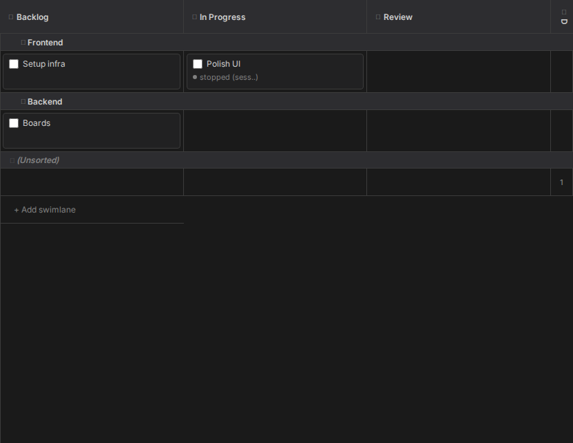
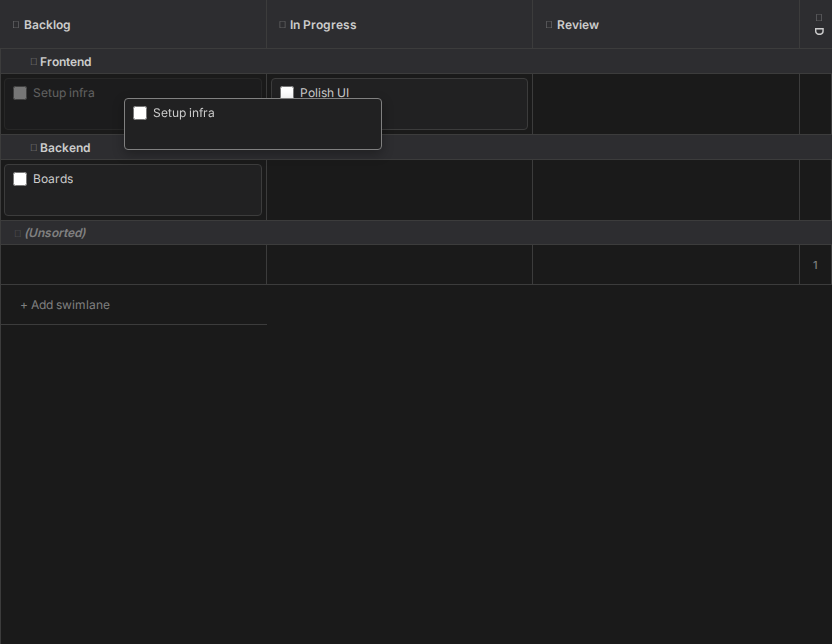
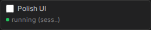

# Boards

A board here is not a service you sync with. It is a `board.yaml` file in your repository, and the
tickets on it are markdown files next to it. Claudebox finds them, draws them as a kanban board,
and writes your changes straight back to disk - so the board is reviewable, diffable and yours.

The payoff is the last step: drag a ticket into an active column and a session starts on it.

## Where a board comes from

Any `board.yaml` in the workspace becomes a board. Two things are derived from where it sits:

- **Its id** is the directory holding it, relative to the workspace root, with slashes turned into
  hyphens - `planning/roadmap/board.yaml` becomes `planning-roadmap`. A `board.yaml` at the
  workspace root is `root`. That id is what appears in the URL, so a board is deep-linkable.
- **Its name** is the board's own `name:` key, falling back to the name of the directory holding
  it. You can rename it inline from the Boards panel, which writes the key.

A ticket's card title comes from the first `#` heading in its file, falling back to the filename.

## Moving a ticket moves the file

Each column declares a folder. Dragging a card to another column rewrites `board.yaml` and
relocates the ticket file into that column's folder, under a lock, atomically. Dragging between
swimlanes reassigns the swimlane without moving anything.

You can also reorder within a cell, drop between two cards to land at that position, `Ctrl`-click
to multi-select and drag the whole selection, and drop onto a column header to change column while
keeping the swimlane. Terminal columns start collapsed and still accept drops.

Columns and swimlanes are editable in place: rename by double-clicking a header, create swimlanes
from the button at the bottom of the board, reorder either axis by dragging or from the context
menu, delete a swimlane and its tickets fall to `(Unsorted)`. Renaming a column changes its
display label only - folders and ticket files stay where they are.

## Dropping into an active column starts work

Mark a column active in `board.yaml` and moving a ticket into it creates a session for that
ticket, if it does not already have one. The board's configured prompt sequence is then delivered
to that session as its opening messages, with `{ticket}` replaced by the ticket's path.

Move a multi-selection in and they share one session, with `{ticket}` expanding to the whole list.

The card then shows that session's status - green while it runs - and everything stays in step
across every browser tab looking at the same board.

## Details

- [Boards panel and ticket board](../SPEC.md#6-boards-panel--ticket-board) - the full behavior contract
- [Panels](panels.md) - where the Boards panel sits
