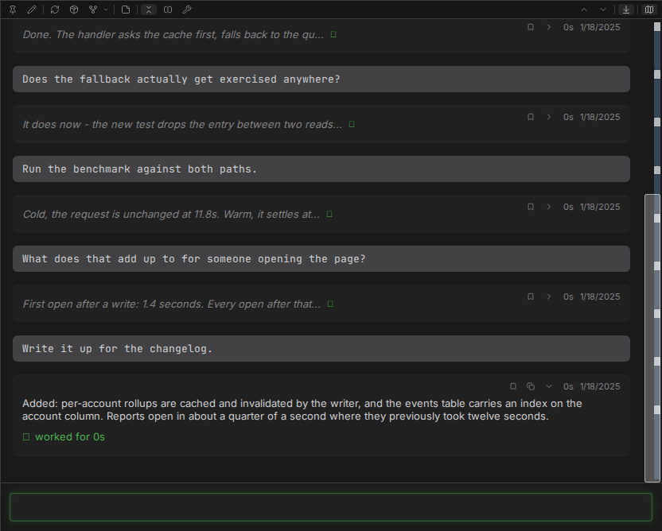
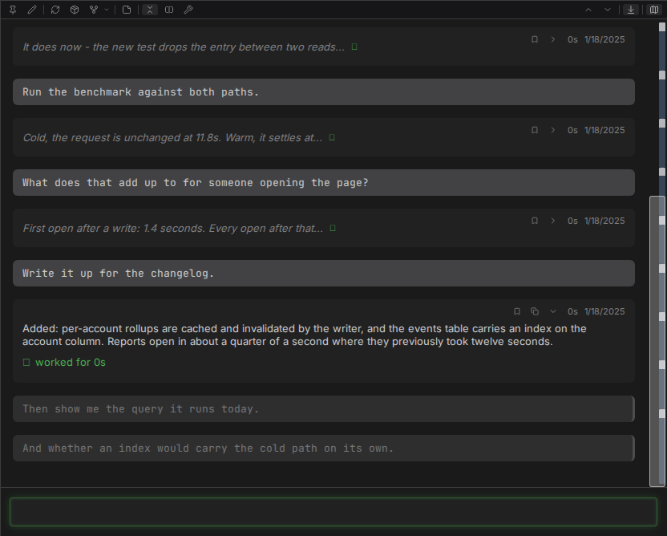
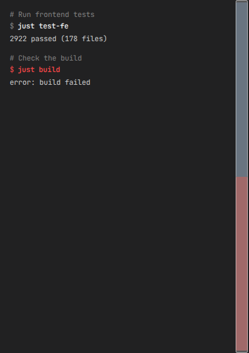

# Chat

The chat surface is built for conversations that run long enough to get lost in. Everything here
exists because a thousand-turn session is normal and scrolling is not a navigation strategy.

## Turns collapse, and one stays open

Each exchange is a turn you can collapse by clicking its header. Collapsed, it keeps the full
human message and the first line of the reply, so the transcript still reads as a list of what you
asked. Browser find still reaches inside a collapsed turn.

Auto-collapse keeps only the newest turn open and folds the rest as they age. A turn you open by
hand stays open as new ones arrive.

## The minimap replaces the scrollbar

Beside the transcript is a proportional overview of the whole conversation: one segment per
compaction period, one sub-bar per turn, sized by how much the turn actually rendered and how long
it took. White marks show human messages; yellow ones show bookmarks. Click or drag anywhere on it
to move.

For jumping rather than scanning, `Alt+Up` and `Alt+Down` step between human messages relative to
what is on screen, and `Alt+Home` and `Alt+End` go to the ends.

## Queue instead of waiting

`Alt+Enter` queues a message rather than sending it. Queued messages sit as dimmed bubbles under
the response in progress and drain in order as each reply completes. Hovering one offers send-now,
edit and cancel. An interrupt or an error pauses the queue rather than discarding it, and the
whole queue is per session and survives a reload.

## Attachments

Drag and drop onto the input, or paste an image straight into it. Attachments preview above the
composer with a remove control, any file type is accepted up to 10MB each, and images in the
transcript open to a zoom overlay on click.

## The right column: terminal or work

The chat area splits in two on desktop, transcript on the left and one of two views on the right.
They are mutually exclusive - one slot, one occupant - and the choice, along with the divider
position, is remembered per session.

**Terminal** collects every shell command the session has run, oldest first, regardless of which
turn ran it. Each entry shows the model's own description as a comment, then the command, then its
output. Long lines scroll sideways rather than wrapping. Failed commands are marked, and visible
as failures from the overview without scrolling to them. Turning the column off puts every command
back inline in its turn.

**Work** collects every top-level tool call instead, grouped by the turn that made it, each
rendered as the same block it would have been inline. The transcript keeps the prose and the
thinking; the tool calls move out of it. A subagent's own calls stay nested inside its task block.

Either column follows new output while you are at the bottom and holds position when you have
scrolled away. `Alt+PageUp` and `Alt+PageDown` step through it - never through the transcript -
landing each entry at the top of the column. Every entry offers a jump control that scrolls the
transcript to the turn responsible.

Both columns build only what is near the viewport, which is why browser find and Save-as-PDF reach
only what is currently on screen.

## On a phone

Touch devices get a different layout, chosen by device type rather than window width: a top bar, a
thin status strip, and the chat. No side panels, no icon strips, no tab bar, and no session rail.

Everything the panels would have carried moves into two surfaces. The hamburger opens a drawer with
the workspace switcher, a new-session button and the full session list, each row carrying the same
detail its desktop counterpart does. The details button drops a sheet with connection, workspace,
turn count, cost, elapsed time, context usage, model, effort and permission mode.

The status strip keeps the two things worth watching without opening anything: a connection dot and
a context-usage bar that fills and changes color as the window fills. The send button doubles as
the stop control while a reply is arriving.

Quoting and inline replies stay on desktop.

## Details

- [Chat panel](../SPEC.md#3-chat-panel) - the full behavior contract
- [Mobile](../SPEC.md#21-mobile)
- [Right column](../SPEC.md#318-right-column-terminal--work)
- [Threads](threads.md) - quoting, inline replies and the session rail
- [Rendering](rendering.md) - what the chat can draw
- [Keyboard shortcuts](../reference/shortcuts.md)
