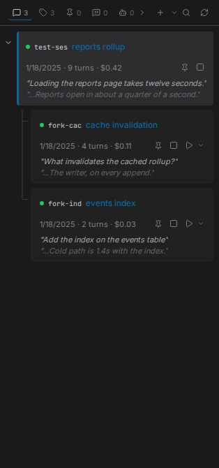
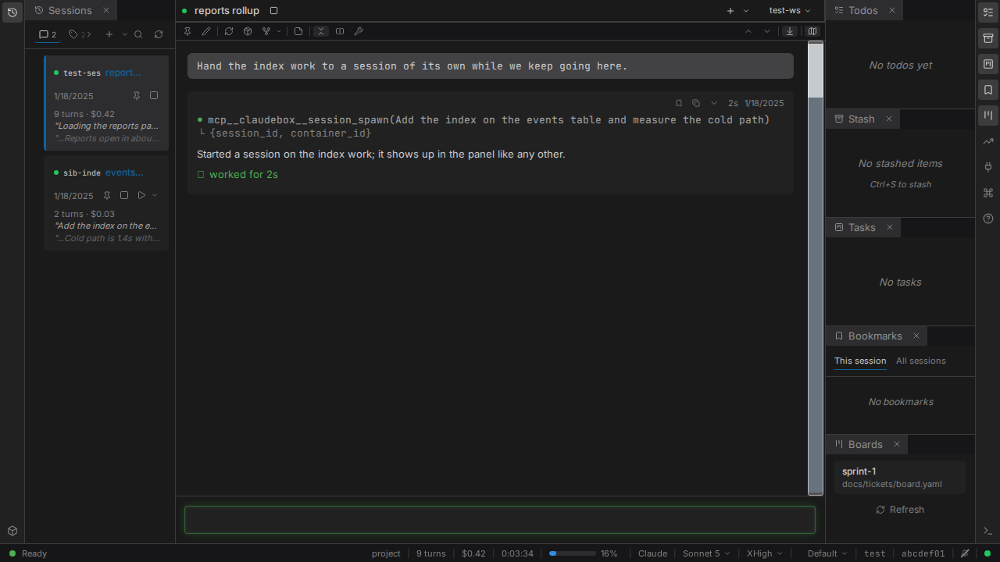

# Many sessions at once

Nothing here runs one agent at a time. Sessions are cheap, isolated, and can be started by you or
by an agent that decides it needs help.

## One container per session

Every session gets its own container. Creating, resuming or forking a session starts one; closing
the browser tab removes it. Sessions in the same workspace share the workspace directory - mounted
at the same path inside the container as outside - and nothing else.

Because the container is the unit, stopping one session never touches another, and a session whose
container is gone still shows its history.

## Several workspaces

Register a second workspace and the switcher starts listing them. Sessions, containers and
interface state are kept separate per workspace, and switching between them is a click.
Registering and deregistering both happen from that switcher; deregistering removes the
registration only, and leaves the `.workspace` marker on disk.

Every session and every board has a URL, so any of it can be bookmarked or shared, and opening a
link to a session in another workspace switches workspace on the way.

## An agent can start a session of its own

An agent can hand a piece of work to a second session, ask it questions, wait for the answers, and
read its transcript. This works the same way in Claude and LangGraph workspaces.

What you see is an ordinary session. The moment the agent starts one, it appears as a row in the
Sessions panel and as a container in the Containers panel, exactly as though you had started it.
You can open it in a tab and read along, or take it over, while the session that started it keeps
running.

If the second session was started from inside the conversation you are reading, it also appears
beside it on the [session rail](threads.md), so both are on screen at once.

**What it cannot do is recurse without bound.** Spawning is depth-capped. An agent that reaches the
cap gets an error naming the cap and the depth it reached, so it stops rather than retrying. The
same bound applies to LangGraph's own in-process sub-agents, which run to completion and report
back as a tool result rather than becoming sessions.

## Details

- [Sibling sessions](../SPEC.md#23-multi-runtime-support) - the behavior contract
- [Workspaces and containers](../SPEC.md#20-workspaces--containers)
- [Threads](threads.md) - the session rail
- [Workspaces guide](../guide/workspaces.md) - markers, registration and storage
