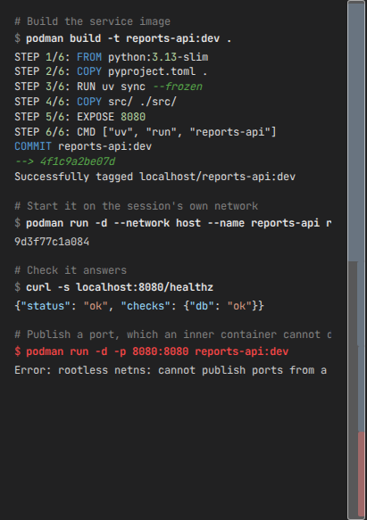

# Nested containers

An agent that can build an image and run a service is an agent that can test its own work end to
end. Claudebox can let one do that inside its session container, without granting it anything on
the host.

It is off unless a workspace asks for it:

```toml
[containers]
nested = true
```

With it on, the agent has `podman`, `buildah`, `podman-compose` and a `docker` compatibility
wrapper. Containers it starts run inside the session container's own namespaces - no
`--privileged` anywhere, invisible to the host and to every other session, and removed when the
session ends. Their storage is in-memory and capped, so image layers an inner build produces do
not outlive the session either.



## The constraints are the important half

The toolchain shares the session container's network namespace rather than taking one of its own.
That single fact produces every limit below. Only the first is silent; the rest fail loudly.

| Constraint | What happens |
|---|---|
| Inner containers cannot publish ports | `-p` is accepted and has no effect - nothing is listening afterwards |
| Ports below 1024 are unavailable | Binding one fails |
| User-defined networks cannot be created | Creating one needs a capability the session container does not hold |
| `podman-compose` services need `network_mode: host` | Without it services cannot reach each other; with it they reach each other on `localhost` |

A service an inner container runs is reachable on `localhost` from inside the session container,
which is where the agent already is. Nothing needs publishing for the agent's own use of it.

## Isolation rests on the workspace's network mode

Inner containers are separated from the host network only because the session container holds a
private network namespace of its own. A workspace that gives that up:

```toml
[network]
mode = "host"
```

puts the session container on the host network, and every container the agent starts inside it
along with them. Read the two settings together before turning either on.

## Details

- [Specification](../SPEC.md#209-nested-containers) - the behavior contract
- [Configuration reference](../reference/configuration.md) - every key, including `[containers]` and `[network]`
