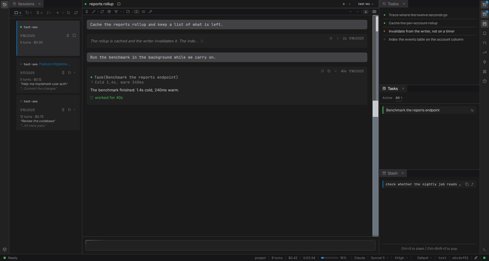
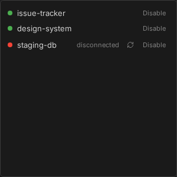
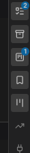

# Panels

The chat is one panel among several. The rest exist because the things you want to watch while an
agent works - what it plans to do, what it has spawned, what it is spending - do not belong in the
transcript, and scrolling back for them costs you your place.

Panels dock around the chat and toggle from icon strips on either edge. Chat itself cannot be
closed. Everything else can be dragged, resized, maximized by double-clicking its tab, and closed
by middle-clicking it. Each panel reopens at the width you left it, and the whole arrangement is
saved as you change it and restored on load - a new session inherits the layout of the last one.

Hovering an icon whose panel is closed opens it as a floating preview, so a glance costs nothing.

## What each one is for

| Panel | Key | What it holds |
|---|---|---|
| Sessions | `Alt+1` | Every session in the workspace as a tree, forks nested under what they forked from. Create, resume, rename, pin |
| Todos | `Alt+2` | The agent's current task list, live, grouped by the subagent that created it |
| Stash | `Alt+3` | A scratch clipboard for prompts. `Ctrl+S` stashes what you have typed, `Ctrl+Shift+S` pops it back |
| Tasks | `Alt+4` | Background tasks the agent has spawned, with live duration. Clicking one lands it in the work column |
| Bookmarks | `Alt+5` | Turns you marked, in this session or across all of them, synced between browser tabs |
| Boards | `Alt+6` | Ticket boards discovered in the workspace |
| Usage | `Alt+7` | Cost over 24 hours, 7 days, 30 days and all time |
| MCP Servers | `Alt+8` | Connection state per server, with reconnect and disable controls |
| Skills | `Alt+9` | The slash commands available to the agent, split into custom, MCP and all |
| Logs | `Alt+0` | The log stream |
| Help | `Alt+?` | The keyboard reference, as an overlay |
| Containers | | Containers running across workspaces |

`Alt+C` returns focus to the chat.

## Badges say when to look

Some icons carry a count, and each one is hidden until it means something.

- **Todos** shows how many items are still incomplete.
- **Stash** shows how many entries are waiting, and nothing when it is empty.
- **Tasks** shows how many background tasks are running right now.
- **MCP Servers** shows how many servers have failed, in red.

That last one is the reason the badges exist: a failed server is the kind of thing you otherwise
discover three turns later, when the agent quietly could not use a tool.

## Details

- [Layout and panel behavior](../SPEC.md#1-layout)
- [Sessions panel](../SPEC.md#5-sessions-panel), [Boards](../SPEC.md#6-boards-panel--ticket-board), [Tasks](../SPEC.md#16-tasks-panel), [Usage](../SPEC.md#17-usage-panel)
- [Keyboard shortcuts](../reference/shortcuts.md)
