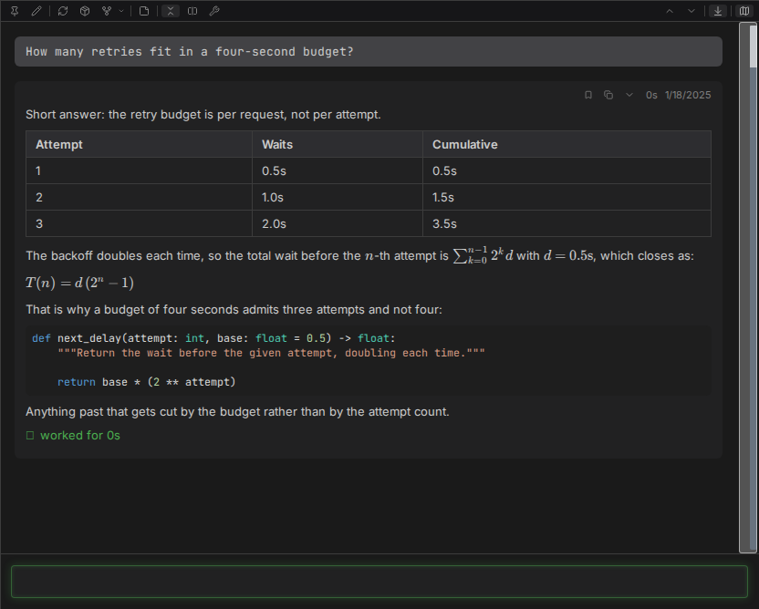
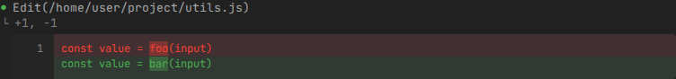
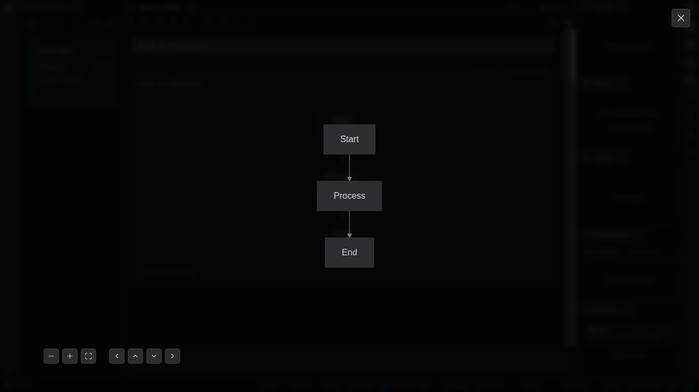

# Rendering

An agent that can only emit plain text has to describe its diagram to you. Claudebox draws it. The
chat is a full document surface, so the answer arrives in whatever shape the answer actually has.

## Text

Replies render as GitHub-flavored markdown: headings, lists, tables, task lists, block quotes,
strikethrough, footnotes. Inline and fenced code is syntax-highlighted, by file extension where
the content names one and by detection where it does not. LaTeX math renders through KaTeX, inline
and display.

Markdown-shaped tool output renders as formatted text rather than raw source, and hovering it
reveals a toggle that switches back to the highlighted source, plus a copy button that takes the
raw markdown.

Messages may also carry common inline and block HTML - collapsible sections, keyboard keys,
definition lists, figures, tables with merged cells - and it appears as real formatting. What
cannot appear is anything that would execute: scripts, inline event handlers, `javascript:` links,
embedded frames and standalone vector graphics are stripped before the message is drawn.



## Diffs

An edit shows as a diff, and consecutive changed lines are compared word by word so you see the
characters that moved rather than two whole lines painted red and green. Unpaired additions and
removals highlight whole-line.



## Paths

File paths in tool output, messages and code blocks resolve against the workspace and become
clickable. Clicking copies the absolute path. With an editor configured, `Alt`-clicking opens the
file there instead - at the right line when the tool knew one.

Configure it with `[editor] url_template`; without it, `Alt`-click just copies.

## Diagrams

A ` ```mermaid ` fence renders as a diagram - whatever diagram types the bundled Mermaid supports,
which is most of what [Mermaid](https://mermaid.js.org/) documents.

- Click a diagram to open it in a zoom and pan overlay, which opens showing the whole thing at its
  natural size rather than stretched to fill.
- Zoom, fit and directional controls sit in the overlay's corner. `+`, `-` and the arrow keys do
  the same, the wheel zooms about the pointer, and dragging pans.
- A toggle switches any diagram between the rendered picture and its highlighted source.
- A diagram that cannot be drawn says so, in a notice above its own source, naming the reason -
  rather than vanishing or leaving a blank frame.

That last point matters more than it sounds. A silently-failed diagram reads as an answer the
agent never gave.



## Details

- [Message display](../SPEC.md#31-message-display) - markdown, HTML and safety
- [Mermaid diagrams](../SPEC.md#314-mermaid-diagrams)
- [Edit diff display](../SPEC.md#4111-edit-diff-display)
- [File path display](../SPEC.md#421-file-path-display)
- [Configuration reference](../reference/configuration.md) - `[editor] url_template`
