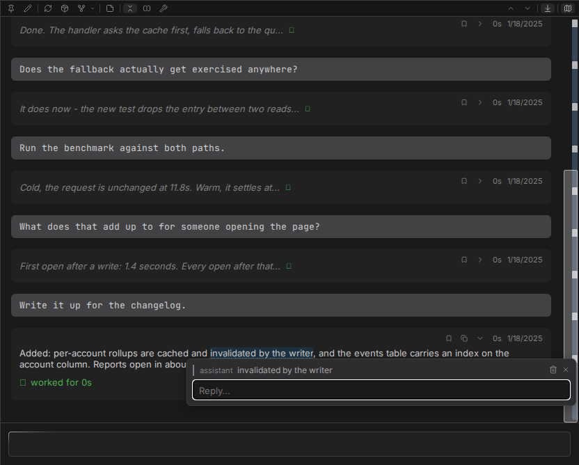
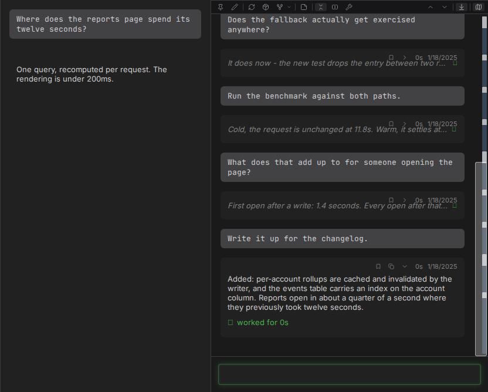
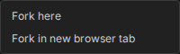

# Threads

A terminal gives a conversation one axis: what was said, in order. Claudebox adds a second. You
can answer a specific sentence where it sits, take that answer somewhere of its own, and keep the
original conversation running the whole time - all in one browser tab.

Quoting and replying are desktop gestures. On a phone the chat is a single column.

## Reply beside what you are replying to

Drag-select anything inside a turn - prose, a code block, tool output, a thinking block - and
click the quote button. The span keeps a durable highlight and a reply box opens beside it,
already carrying the quote and who said it.

Open as many as you like. Each box stays beside its own highlight as the transcript scrolls, and
none of them overlaps another. Unsent replies survive a reload.

From there the two paths diverge, and the difference is what the feature is for.

**Send them together.** Sending from the message box delivers one turn carrying every buffered
reply, plus whatever you typed in the composer. The turn shows a compact placeholder that expands
to reveal each quote and its reply. Empty replies are dropped.

**Ask one on its own.** Answer a single reply where it sits and the conversation it was quoted
from does not change - same turns, same count, nothing added. It does not wait for that
conversation either, whether it is idle or already answering something else. The answer arrives in
the box beside the quote, and you can keep following up there.

## Take a thread somewhere

A reply you answered on its own can live in any of these.

| Destination | Container | Where it lives |
|---|---|---|
| Stays where it is | Shared with the source | Beside its quote |
| Promoted onto the rail | Shared with the source | Its own group, beside the conversation it came from |
| Promoted to its own session | New container, new browser tab | A conversation of its own |

Promote onto the rail and the thread becomes an ordinary session group - reading the same way any
other does - opening at its own exchange, with everything it inherited folded behind a single line
you can click to unfold.

## One tab holds a chain, not a session

The session rail is the second axis made visible. A session that spawned children shows them
alongside it, root at the left, each group started from inside the one to its left.

Exactly one group is focused. That one has the message box, the control bar and the split into
transcript plus right column. The others sit beside it as single columns, reading. Focus moves
with `Alt+Shift+Left` and `Alt+Shift+Right`, or by clicking a name in the session header path.

Each group keeps its own draft, its own history and its own message queue. Sending reaches the
focused group alone. Scrolling one moves only that one. The whole rail comes back after a reload,
same groups, same order, same one focused.

Drill deep enough and the rail stops widening: it keeps the root and the groups nearest your
focus, and the ones in between stay reachable from the session header path.

Unrelated sessions still mean separate browser tabs. A chain does not.

## Fork and rewind

Every human message carries a rewind button, and the control bar forks the whole conversation
without truncating it. Three variants:

| Variant | Container | Where you end up |
|---|---|---|
| Fork here | Reuses the current one | Replaces the current view |
| Fork in new browser tab | New | A new browser tab |
| Fork as a side conversation | Shared with the source | Stays in place |

A fork takes the place its source held, and the source keeps its own history intact and viewable.
Forks inherit the parent's name, model, permission mode, effort level and session prompt, and then
diverge from there.

## Details

- [Inline replies](../SPEC.md#317-inline-replies) - the full behavior contract
- [Session rail](../SPEC.md#319-session-rail)
- [Conversation rewind](../SPEC.md#312-conversation-rewind)
- [Keyboard shortcuts](../reference/shortcuts.md)
