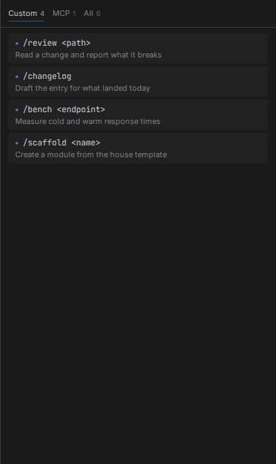

# Writing a profile

A profile is a directory. It carries the system prompt your agent runs with, the shell hooks that
shape its container, and the skills, subagents and slash commands it can reach. Everything that
makes an agent yours rather than stock lives in one place you can version.

## You already have one

A fresh install copies the shipped sample to `~/.claudebox/profile`, so there is something to read
and edit before you write a line. Point somewhere else whenever you like:

```toml
profile = "~/code/my-profile"
```

The directory it names may contain any of these, and nothing is required:

```
profile/
├── agents/
│   └── example.md         Subagent definition
├── commands/
│   └── example.md         Slash command
├── config/
│   ├── .gitconfig         Linked into the container at session start
│   └── claude.json        Copied to the agent's settings at session start
├── hooks/
│   ├── container-start.sh
│   ├── container-end.sh
│   ├── agent-start.sh
│   ├── agent-stop.sh
│   └── image-build.sh
├── prompt.md              System prompt entry point
└── skills/
    └── example/
        └── SKILL.md       Skill definition
```

## The system prompt

`prompt.md` is the entry point. A runtime other than the default reads `prompt.<agent>.md`
instead - `prompt.langgraph.md` for LangGraph - so you can give the two different instructions
without maintaining two copies of everything.

Neither file has to be one file. Include forms compose it:

| Form | Resolves to |
|---|---|
| `{{ relative/path }}` | A path relative to the prompt file, interpolated again in turn |
| `{{ @path }}` | A path relative to the workspace root |
| `{{ /absolute/path }}` | That exact path, included as-is |
| `{{ !name }}` | The output of the built-in `name` - `path` for the working directory, `tree` for a filtered listing of the workspace |

Two behaviors are worth knowing before you are surprised by them.

**An executable target is run, not read.** If the file an include names has its executable bit set,
Claudebox runs it and includes what it prints. That is how a prompt gets today's date, the current
branch, or anything else that has to be computed at session start - and it is also why a stray
`chmod +x` on a prompt fragment makes it vanish from the output.

**Only fragments beside the prompt are interpolated recursively.** What decides this is where the
target lands, not which form named it: anything resolving inside the prompt file's own directory is
expanded again, so includes can nest, and anything outside it is included literally, braces and all.

Indentation carries, on one condition: an include whose line holds nothing but whitespace before
the braces indents every line it brings in, so a fragment dropped into a fenced block keeps its
place. Put anything else on that line first - a list marker, a label - and the following lines come
in unindented.

## Hooks

The shell hooks, and the difference between them is not cosmetic.

| Hook | Runs | How |
|---|---|---|
| `container-start.sh` | Container starts | Sourced - it can export variables the session keeps |
| `container-end.sh` | Container exits | Sourced |
| `agent-start.sh` | Before an interactive session begins | Executed as its own process, once |
| `agent-stop.sh` | After an interactive session ends | Executed as its own process, once |
| `image-build.sh` | Image build | Becomes a layer of the image |

Sourced hooks run inside the container's own shell, so what they set survives. Executed hooks do
not - anything they export is gone when they exit. Reach for `container-start.sh` when you want
the environment changed, and `agent-start.sh` when you want something done.

`agent-start.sh` and `agent-stop.sh` are skipped for non-interactive runs.

Beyond shell, a profile can carry Python hooks that plug into the agent's own lifecycle events -
session start, before and after a tool call, before compaction - through the `@hook` and
`@statusline` decorators.

## Making skills and commands visible

The sample's `container-start.sh` earns its place here: it symlinks the profile's `agents/`,
`commands/` and `skills/` directories into the agent's configuration directory at the start of
every session. That symlink is what makes them discoverable. A profile that replaces the hook
without keeping that loop gets a profile whose skills never appear.

It also copies `config/claude.json` over the agent's settings, so changes made during a session do
not leak back to the host, and links `config/.gitconfig` so commits carry your identity.

A `commands/*.md` file needs YAML frontmatter with a `name`. A `skills/<name>/SKILL.md` falls back
to its directory name when frontmatter omits one. A file that fails to parse is dropped rather than
half-loaded, so it simply never appears in the Skills panel or in `/` autocomplete.



## Details

- [Configuration reference](../reference/configuration.md) - the `profile` key
- [Panels](../features/panels.md) - the Skills panel, where commands show up
- [Runtimes](runtimes.md) - which prompt file each runtime reads
