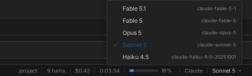

# Choosing a runtime

Claudebox runs Claude through the Claude Agent SDK by default. Set one key and it runs LangGraph
instead, which talks to any LangChain-supported provider - Anthropic, OpenAI, Google, Groq,
Mistral, AWS Bedrock, or a model on your own machine through Ollama or an OpenAI-compatible server.

```toml
agent = "langgraph"

[langgraph]
model = "anthropic:claude-sonnet-5"
```

Provider packages ship preinstalled, so switching is configuration and a relaunch. The footer says
which runtime a session is on, and the model picker beside it lists what that runtime offers.



## What stays the same

More than you would expect. Under LangGraph the agent still has filesystem, shell, search, web and
notebook tools, and their results render as the same tool blocks. It still spawns sub-agents, still
drives the task list and the Tasks panel, still asks structured questions through the in-chat form,
still discovers and runs your skills - including typed `/<skill>` commands and the autocomplete -
still connects to MCP servers, and can still hand work to a second session and read its answers.

## What changes

**There is no permission mode and no per-action approval.** Under Claude you can be asked before a
tool runs. Under LangGraph you cannot: the container is the isolation boundary for the entire tool
surface, and nothing sits in front of it. Decide that on purpose, not by discovering it.

**Some controls disappear**, because the runtime does not implement what they set: the effort
picker, the permission-mode picker, the mid-session model picker, the manual compaction button, and
the MCP control panel. Where a runtime does not report cost telemetry, the per-turn cost summary
does not appear either.

**Compaction is the runtime's own.** The manual compact control belongs to Claude; a session prompt
is re-supplied after compaction on both.

## Providers

The model id follows LangChain's `provider:model-id` convention, and credentials come from the
environment rather than from your settings file.

| Provider | Environment variable | `model =` |
|---|---|---|
| Anthropic | `ANTHROPIC_API_KEY` | `"anthropic:claude-sonnet-5"` |
| OpenAI | `OPENAI_API_KEY` | `"openai:gpt-4o"` |
| Google Gemini | `GOOGLE_API_KEY` | `"google_genai:gemini-2.5-pro"` |
| Groq | `GROQ_API_KEY` | `"groq:llama-3.3-70b-versatile"` |
| Mistral | `MISTRAL_API_KEY` | `"mistralai:mistral-large-latest"` |
| Ollama | none | `"ollama:llama3.2:3b"` |
| A local OpenAI-compatible server | none | `"openai:<model>"` plus `[langgraph.openai] base_url` |

Per-provider knobs go in `[langgraph.<provider>]` and are forwarded verbatim to that provider's
constructor - which is where reasoning is turned on, since each provider spells it differently:

```toml
[langgraph.ollama]
base_url = "http://host.containers.internal:11434"
reasoning = true

[langgraph.anthropic]
thinking = { type = "adaptive" }

[langgraph.openai]
reasoning_effort = "high"
```

A model's thinking appears in the transcript only where the provider has been asked to return it.

## A word on network

Model calls, web fetch and search, and any MCP server you declare all make outbound requests from
the container. The container's network policy is the real boundary - worth reviewing your
configured providers before pointing this at a workspace whose contents are sensitive.

## Details

- [Multi-runtime support](../SPEC.md#23-multi-runtime-support) - the behavior contract
- [Configuration reference](../reference/configuration.md) - every `[langgraph]` key
- [Profiles](profiles.md) - the per-runtime prompt file
