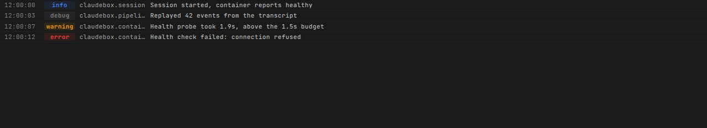

# When something goes wrong

Roughly in the order a first run hits them.

## Start here

```bash
claudebox doctor
```

It runs an ordered set of environment checks and prints one row each - container runtime, `uv`,
the daemon over HTTP, the daemon's service unit, the watchdog timer, the library directory, your
profile, the workspace marker, permissions, and free space in `/tmp`. A tick passed, a cross
failed, a circle is informational (no profile configured, no workspace marker). It exits non-zero
if anything failed, so it is safe to put in a script.

Add `-v` to see the probe behind each row when a result surprises you.

## No container runtime

The installer does not supply podman or docker, and does not check for one. If neither is present,
nothing else works. Install one first.

For rootless podman specifically, `podman system migrate` and a set `XDG_RUNTIME_DIR` resolve most
socket errors.

## The first run takes ten minutes

Expected once. The first install builds a multi-layer container image; later runs reuse the cached
layers. `claudebox build --layer agent` rebuilds only the agent layer afterwards, which is the fast
path for picking up a new agent release; `--layer all` discards every cache.

## The browser warns about the certificate

Expected, once per browser. The daemon is fronted by Caddy with a self-signed certificate. Accept
it and it stays accepted.

## Nothing is served at all

The daemon may not be running.

```bash
systemctl --user status claudebox-daemon.service
```

On macOS and anywhere else without systemd the service is not installed, and the daemon is started
by hand:

```bash
claudeboxd
```

If the port is taken, either free it or move: `claudeboxd --port <other>`.

## A container will not start

Run the CLI verbosely to see the full runtime command it issued, then read the logs:

```bash
claudebox --verbose run
```

## Disk fills up

Stopped containers, dangling images and stale directories accumulate.

```bash
claudebox prune        # a summary count
claudebox -v prune     # every item it removed
```

## Finding the logs

Daemon logs are under `~/.claudebox/logs/`, and each session keeps its own inside its session
directory. Under systemd:

```bash
journalctl --user -u claudebox-daemon.service -f
```

Or stream them from the CLI, which can also multiplex every container alongside the daemon:

```bash
claudebox logs           # the daemon
claudebox logs all       # daemon plus every container, prefixed by source
```

The same stream is in the interface, on the Logs panel (`Alt+0`), which follows the session you are
looking at.



## Find-on-page misses older messages

Not a fault. The chat and the terminal column build only the entries near the viewport, so long
sessions stay fast, and the browser can only search or print what is currently built. Scroll to the
region first. For the transcript, the minimap and `Alt+Up` / `Alt+Down` get you there faster.

## Details

- [CLI reference](../reference/cli.md) - every verb and flag
- [Configuration reference](../reference/configuration.md)
- [Start here](../start.md) - the install path from the beginning
