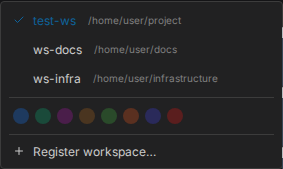

# Working across workspaces

Claudebox runs unscoped by default: one pool of sessions, credentials and interface state under
`~/.claudebox/`. That is fine until you have two projects, at which point one project's sessions
are in the other's list.

A workspace fixes that. It is a marker file.

## Scope a project

```bash
touch .workspace
```

From then on, everything for that project lives under `{project}/.claudebox/` instead of your home
directory - sessions, credentials, interface state. Nothing crosses between workspaces.

The marker is the whole mechanism. Claudebox walks up from wherever you are looking for it, and
where it finds one, that directory is the root.

## Register it

A marker scopes storage. Registering is what puts the workspace in the web interface:

```bash
claudebox workspaces register        # the workspace you are standing in
claudebox workspaces list
claudebox workspaces deregister <id>
```

You can also register from the browser, through the workspace switcher's "Register workspace"
item, and deregister a workspace by clicking the trash control on its row. Deregistering removes
the registration only - the `.workspace` marker and everything under `.claudebox/` stay.

The switcher itself is always there. With one workspace it offers the accent-color palette; once
a second is registered it also lists the workspaces, with the active one marked.



## The id in the URL

A workspace's id is its directory name. Two projects with the same directory name would collide,
so the second one to register gets an eight-character hash of its absolute path appended -
`api` and `api-3f2b9c41`. That is why an id sometimes carries a suffix and usually does not.

## What lands where

Relative to whichever root is active - the workspace directory, or your home directory when there
is no marker:

| Path | Contents |
|---|---|
| `.claudebox/settings.toml` | Settings for this scope |
| `.claudebox/sessions/` | One directory per session: events, logs, per-session state |
| `.claudebox/fs/root/.claude.json` | The agent's credentials, mounted into the container |
| `.claudebox/fs/root/.claude/` | The agent's configuration directory |

Treat the credential file as you would any other API token.

## Links

Every view has a URL, so anything on screen can be bookmarked or handed to someone else.

| Hash | Opens |
|---|---|
| `#/workspaces/{id}` | The workspace, no session |
| `#/workspaces/{id}/sessions/{sid}` | A session, scrolled to its latest message |
| `#/workspaces/{id}/sessions/{sid}/turns/u-{tid}` | A session, paused at a human message |
| `#/workspaces/{id}/sessions/{sid}/turns/a-{tid}` | A session, paused at an assistant message |
| `#/workspaces/{id}/boards/{bid}` | A board |

Opening a link into a workspace other than the current one switches workspace on the way.

## Details

- [Workspaces and containers](../SPEC.md#20-workspaces--containers) - the behavior contract
- [Configuration guide](configuration.md) - where settings files are read from
- [Many sessions](../features/multi-session.md)
