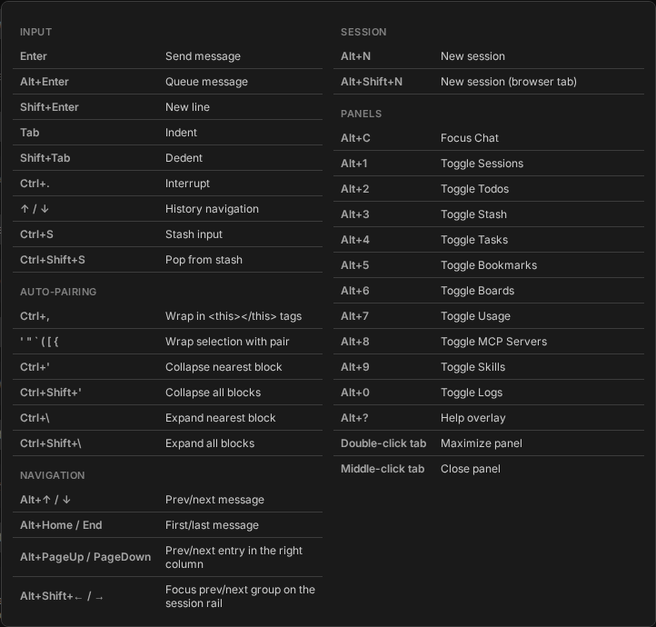

# Keyboard shortcuts

Every binding the app registers, generated from the same list the in-app Help panel draws. This
file is generated - run `just docs` to bring it back in step after changing a binding.

`Alt+?` opens that overlay over whatever you are looking at; Escape closes it.

## Input

| Shortcut | Action |
|---|---|
| `Enter` | Send message |
| `Alt+Enter` | Queue message |
| `Shift+Enter` | New line |
| `Tab` | Indent |
| `Shift+Tab` | Dedent |
| `Ctrl+.` | Interrupt |
| `↑ / ↓` | History navigation |
| `Ctrl+S` | Stash input |
| `Ctrl+Shift+S` | Pop from stash |

## Auto-pairing

| Shortcut | Action |
|---|---|
| `Ctrl+,` | Wrap in &lt;this&gt;&lt;/this&gt; tags |
| `` ' " ` ( [ { `` | Wrap selection with pair |
| `Ctrl+'` | Collapse nearest block |
| `Ctrl+Shift+'` | Collapse all blocks |
| `Ctrl+\` | Expand nearest block |
| `Ctrl+Shift+\` | Expand all blocks |

## Navigation

| Shortcut | Action |
|---|---|
| `Alt+↑ / ↓` | Prev/next message |
| `Alt+Home / End` | First/last message |
| `Alt+PageUp / PageDown` | Prev/next entry in the right column |
| `Alt+Shift+← / →` | Focus prev/next group on the session rail |

## Session

| Shortcut | Action |
|---|---|
| `Alt+N` | New session |
| `Alt+Shift+N` | New session (browser tab) |

## Panels

| Shortcut | Action |
|---|---|
| `Alt+C` | Focus Chat |
| `Alt+1` | Toggle Sessions |
| `Alt+2` | Toggle Todos |
| `Alt+3` | Toggle Stash |
| `Alt+4` | Toggle Tasks |
| `Alt+5` | Toggle Bookmarks |
| `Alt+6` | Toggle Boards |
| `Alt+7` | Toggle Usage |
| `Alt+8` | Toggle MCP Servers |
| `Alt+9` | Toggle Skills |
| `Alt+0` | Toggle Logs |
| `Alt+?` | Help overlay |
| `Double-click tab` | Maximize panel |
| `Middle-click tab` | Close panel |
