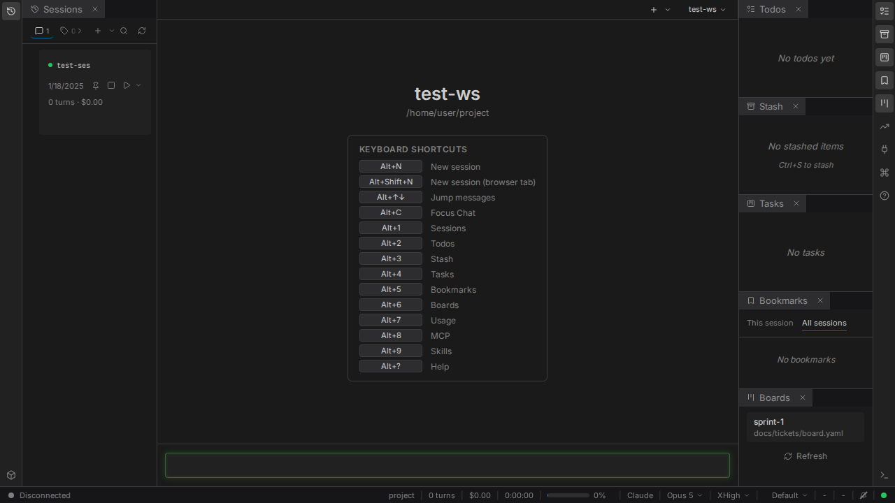
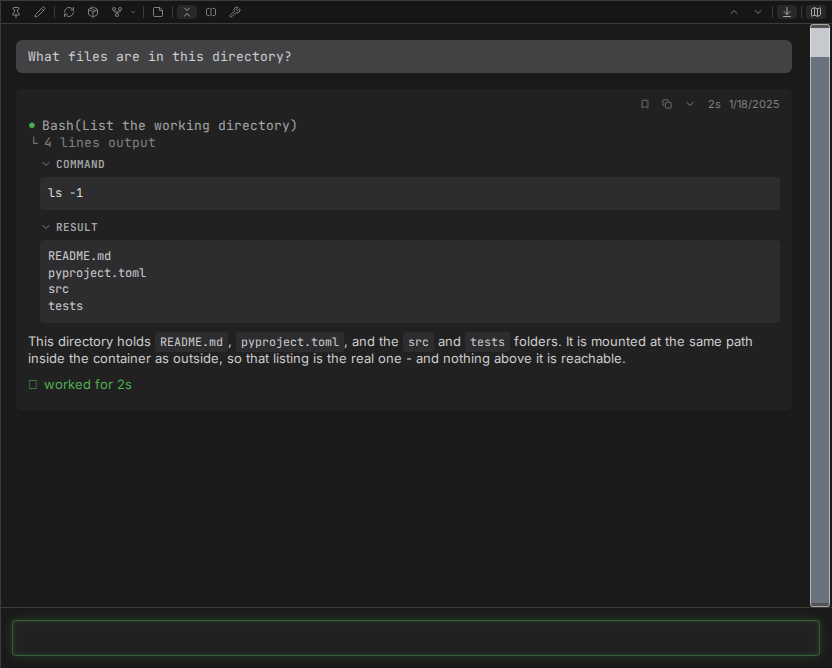

# Start here

From nothing to an agent answering a message. Ten minutes, most of it the first image build.

## One prerequisite you have to supply

**Podman or Docker.** The installer neither installs a container runtime nor checks that you have
one, and nothing works without it. Install one first, and for podman confirm rootless mode works:

```bash
podman info
```

Also needed, and almost certainly already present: git and bash. Python and Node are handled for
you - the installer fetches them through `uv` and `nvm` if they are missing.

## Install

```bash
curl -LsSf https://raw.githubusercontent.com/jakubro/claudebox/main/bin/install.sh | bash
```

For Docker instead of Podman:

```bash
CLAUDEBOX_BACKEND=docker curl -LsSf https://raw.githubusercontent.com/jakubro/claudebox/main/bin/install.sh | bash
```

This clones the library, builds the frontend and the container image, installs the `claudebox` CLI
and the `claudeboxd` daemon, registers the daemon as a user service, and adds a timer that keeps
the image current.

The image is built in layers, and the first build is the slow one - expect five to fifteen minutes
depending on network and CPU. Later runs reuse the cache.

## Authenticate, once

```bash
claudebox run
```

The first launch opens the agent's own terminal interface, where you log in. Credentials persist
afterwards - per project when that project has a workspace marker, globally when it does not.

## Open the interface

```
https://localhost:41820
```

Your browser will warn about the certificate. That is expected: the daemon sits behind Caddy with a
self-signed certificate. Accept it once per browser and it stays accepted.



If nothing is served, the daemon is not running. Under systemd it was installed as a user service;
without systemd - on macOS, for instance - start it yourself with `claudeboxd`.

## Send the first message

Type into the box at the bottom and press `Enter`. That creates a session, starts its container,
and sends your message as its first turn.

Ask it something that touches the filesystem, because that is what shows you the isolation is real:

```
What files are in this directory?
```

The reply lists your working directory. That directory is mounted into the container at the same
path it has outside, so the agent reads and writes the real thing - and nothing above it.



## Where it all went

Everything for the session is on disk, under `~/.claudebox/` by default:

| Path | Contents |
|---|---|
| `~/.claudebox/sessions/` | One directory per session - events, logs, state |
| `~/.claudebox/settings.toml` | Your settings |
| `~/.claudebox/profile/` | The profile the installer copied for you |
| `~/.claudebox/logs/` | Daemon logs |

To keep one project's sessions out of another's, `touch .workspace` in the project root and
everything moves under `{project}/.claudebox/` instead. That is the
[workspaces guide](guide/workspaces.md).

## Next

- [Chat](features/chat.md) - what the interface gives you that a terminal does not
- [Profiles](guide/profiles.md) - the prompt, hooks and skills your agent runs with
- [Configuration](guide/configuration.md) - mounts, ports, environment, editor integration
- [Troubleshooting](guide/troubleshooting.md) - if any step above did not go as written
